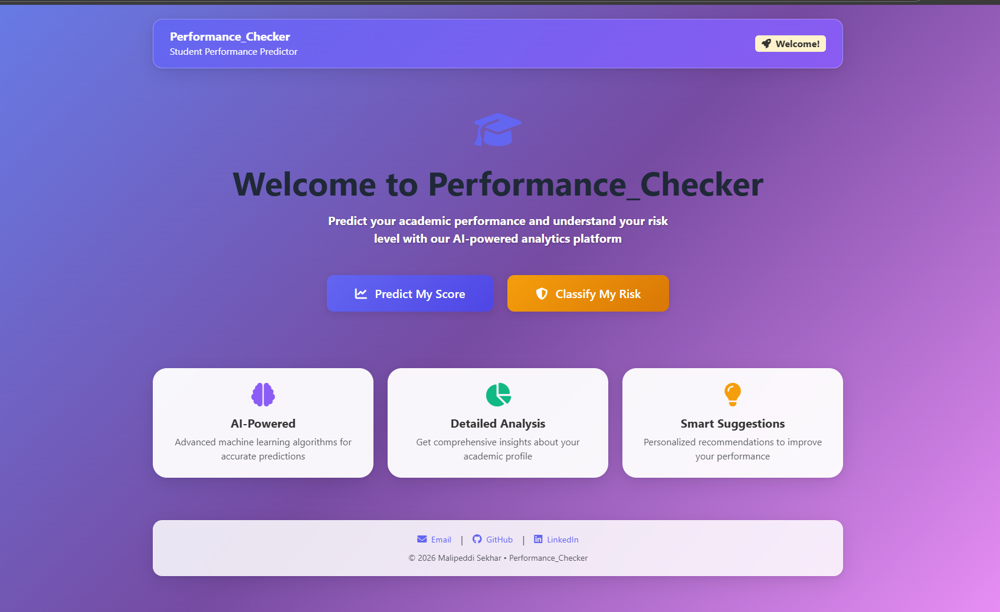
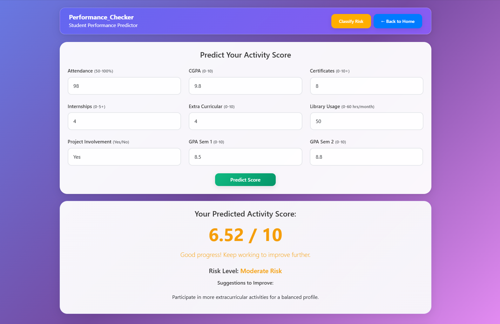

# Performance_Checker – Student Performance Prediction System

## Overview

**Performance_Checker** is a web-based application designed to predict student performance using machine learning. Built with Flask, it helps forecast a student's activity score and assess academic risk based on multiple input factors. The goal is to empower students, educators, and academic advisors to take informed, proactive measures by offering timely insights and recommendations.

## 📸 Screenshots

### Home Page


### Score Predictor


### Risk Classifier


### Prediction Results


## Key Features

* Clean, modern UI with glassmorphism design
* Intuitive interface for easy student data entry
* Collects detailed academic information including grades, attendance, and CGPA (10-point scale)
* Predicts activity score using Random Forest Regressor
* Classifies academic risk level using Random Forest Classifier
* Provides personalized suggestions based on predictions
* Fully responsive design for all screen sizes

## Tech Stack

* **Frontend**: HTML5, CSS3, Bootstrap 5
* **Backend**: Python (Flask)
* **Machine Learning**: scikit-learn (Random Forest), joblib
* **Icons**: Font Awesome

## Project Structure

```
Performance_Checker/
├── app.py                 # Flask backend application
├── requirements.txt       # Python dependencies
├── models/
│   ├── RandomForestClassifier.pkl
│   └── RandomForestRegressor.pkl
├── static/
│   └── style.css          # Custom styles
├── templates/
│   ├── index.html         # Home page
│   ├── predictor.html     # Score prediction page
│   └── classifier.html    # Risk classification page
├── Dataset/
│   └── dataset.csv        # Training data
└── README.md
```

## Getting Started

### 1. Clone the Repository

```bash
git clone https://github.com/malipeddisekhar/Performance_Checker
cd Performance_Checker/
```

### 2. Install Dependencies

```bash
pip install -r requirements.txt
```

### 3. Run the Application

```bash
python app.py
```

### 4. Open in Browser

Visit `http://localhost:5000` to access the application.

## Input Parameters

| Field | Range | Description |
|-------|-------|-------------|
| Attendance | 50-100% | Percentage of classes attended |
| CGPA | 0-10 | Cumulative Grade Point Average |
| Certificates | 0-10+ | Number of certifications earned |
| Internships | 0-5+ | Number of internships completed |
| Extra Curricular | 0-10 | Extracurricular activity score |
| Library Usage | 0-60 hrs | Hours spent in library per month |
| Project Involvement | Yes/No | Whether involved in projects |
| GPA Sem 1 | 0-10 | First semester GPA |
| GPA Sem 2 | 0-10 | Second semester GPA |

## Author

**Malipeddi Sekhar**
- Email: malipeddisekhar63@gmail.com
- GitHub: [github.com/malipeddisekhar](https://github.com/malipeddisekhar)
- LinkedIn: [linkedin.com/in/malipeddi-sekhar-08650630b](https://www.linkedin.com/in/malipeddi-sekhar-08650630b/)

## License

This project is licensed under the MIT License by MalipeddiSekhar.
